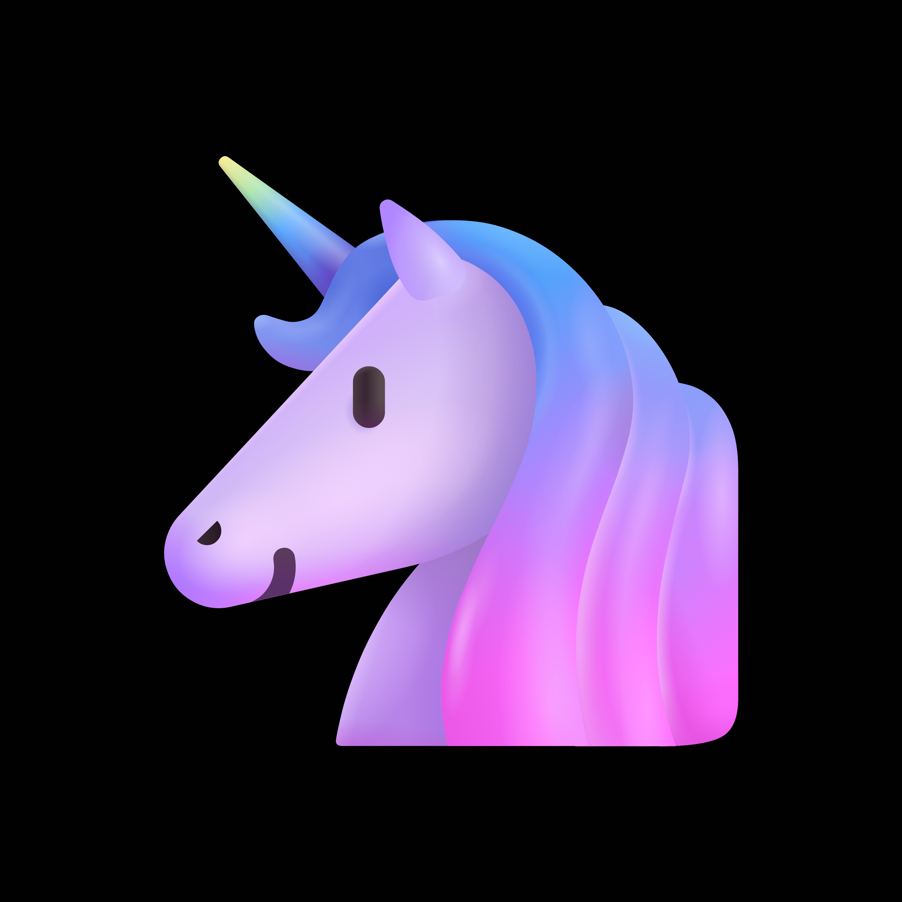

# 🦄 Globaly Genius - Brand Guidelines

## 🎨 Brand Identity Assets

### **Main Colors**
css
--primary-bg: #000100;    /* Deep Space Black */
--accent-color: #8A2BE2;  /* Electric Purple */
--secondary-color: #00FFFF; /* Cyber Cyan */
--text-primary: #FFFFFF;
--text-secondary: #B0B0B0;

### **🖼️ Visual Assets**

#### **Profile Avatar** (500×500px)

- **Format:** PNG with transparent background
- **Style:** Modern unicorn silhouette with gradient accent
- **Usage:** GitHub, social media profiles, avatars

#### **Desktop Cover** (1500×500px)

- **Layout:** Left-aligned branding with tech pattern background
- **Elements:** Logo, tagline "AI Innovation from Belarus"
- **Color:** Dark theme with #000100 background

#### **Mobile Cover** (800×400px)

- **Optimized:** For mobile devices with centered composition
- **Simplified:** Clean layout for small screens

#### **Watermark** (200×200px)

- **Transparent PNG** for overlaying on project demos
- **Minimal:** Subtle unicorn icon with glow effect

## **🎯 Brand Elements**

### **Typography**
- **Primary Font:** Inter, -apple-system, BlinkMacSystemFont, sans-serif
- **Code Font:** 'Fira Code', 'JetBrains Mono', monospace
- **Headings:** Semi-bold (600)
- **Body:** Regular (400)

### **Logo Variations**

avatar.png          - Main profile picture
logo-full.png       - Full logo with text
logo-icon.png       - Icon only (unicorn)
watermark.png       - Transparent overlay
favicon.ico         - Website favicon (32×32)

### **📱 Social Media Assets**

#### **Twitter Header** (1500×500px)
- Branded background with @globalygenius handle
- AI/tech visual elements

#### **Discord Banner** (960×540px)
- Custom design for server branding
- Matching purple/cyan theme

#### **Telegram Channel** (1000×800px)
- Branded channel header image
- Consistent color scheme

## **🚀 Usage Guidelines**

### **Do's**
✅ Use primary background #000100 for dark themes  
✅ Maintain 16px minimum spacing around logo  
✅ Use Electric Purple (#8A2BE2) for primary actions  
✅ Apply Cyber Cyan (#00FFFF) for highlights and accents  

### **Don'ts**
❌ Don't stretch or distort the logo  
❌ Don't use colors outside the brand palette  
❌ Don't place on busy backgrounds (watermark excepted)  
❌ Don't modify the unicorn icon design  

## **📦 File Structure**

brand/
├── avatars/
│   ├── avatar.png
│   ├── avatar-square.png
│   └── avatar-round.png
├── covers/
│   ├── cover-desktop.png
│   ├── cover-mobile.png
│   └── cover-social.png
├── logos/
│   ├── logo-full.png
│   ├── logo-icon.png
│   └── watermark.png
└── social/
    ├── twitter-header.png
    ├── discord-banner.png
    └── telegram-channel.png

## **🎨 Color Applications**

### **Web Design**
css
.primary-bg { background-color: #000100; }
.accent-color { color: #8A2BE2; }
.secondary-color { color: #00FFFF; }

### **Code Syntax**
javascript
// Electric Purple for functions
function createAI() { ... }

// Cyber Cyan for variables
const innovation = true;

### **Graphics**
- **Primary:** #000100 (backgrounds)
- **Accent:** #8A2BE2 (buttons, links)
- **Highlight:** #00FFFF (icons, alerts)

---

**© 2025 Globaly Genius** — *Consistent branding across all platforms*
